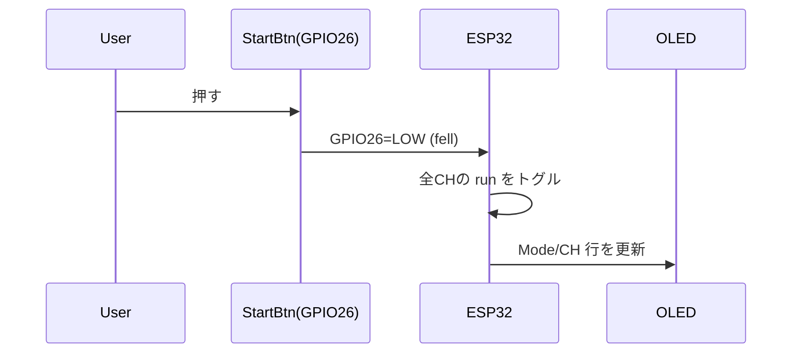
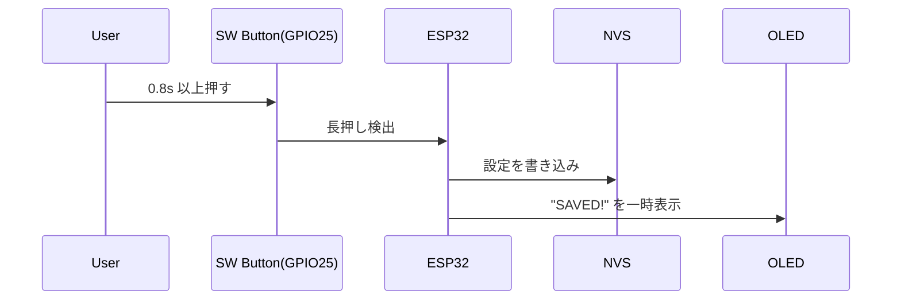
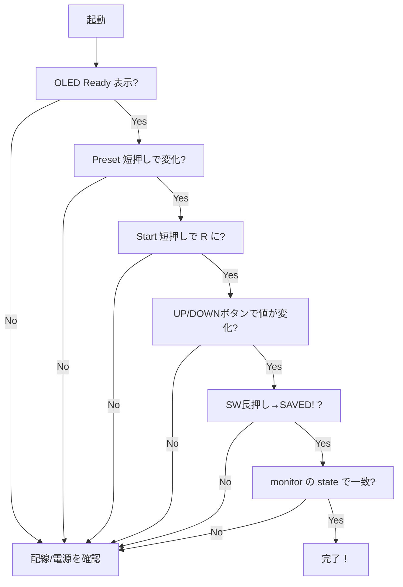

# Universal Function Generator (ESP32 + OLED + Buttons)

> **用途**: 擬似ウインカー/ハザードの再現をはじめ、4ch の矩形波点滅を作れる **汎用ファンクションジェネレータ**。  
> **対象**: 初心者～非エンジニア歓迎（物理ボタンだけでも操作OK）／開発者向け詳細も同梱。

---

## 目次
- [概要](#概要)
- [主な機能](#主な機能)
- [ハードウェア構成](#ハードウェア構成)
- [配線とピンアサイン](#配線とピンアサイン)
- [安全・回路ノート（セラコン/抵抗の補足を含む）](#安全回路ノートセラコン抵抗の補足を含む)
- [OLED 画面の見方](#oled-画面の見方)
- [操作方法（物理）](#操作方法物理)
- [monitor とは？](#monitor-とは)
- [操作方法（monitor）](#操作方法monitor)
- [OLED ←→ 操作の対応表](#oled--操作の対応表)
- [確認方法（誰でもできるチェックリスト）](#確認方法誰でもできるチェックリスト)
- [シーケンス図・確認フロー（Mermaid）](#シーケンス図確認フロー)
- [FAQ / よくある間違いと対処](#faq--よくある間違いと対処)
- [ビルド & 書き込み（PlatformIO）](#ビルド--書き込みplatformio)
- [ライセンス](#ライセンス)

---

## 概要
ESP32 と 128x64 OLED(SSD1306等)、タクトスイッチ 5個で構成された **4 チャンネル矩形波ジェネレータ**です。  
各 CH は **ON 時間 / OFF 時間**（µs 単位内部管理）と、**起動時の位相（初回 ON 延長）**が設定可能。  
**擬似ウインカー**や **ハザード**の作動検証、LED 点滅パターンの試作などに最適です。

- マスク（left/right/hazard）で 2ch/4ch の同期点滅を簡単に呼び出し
- UP/DOWN ボタンで **感覚的に**値変更（長押しで加速）／保存（SW 長押し）
- USB シリアル（monitor）から **コマンド操作**も可能（詳細ログあり）
- 設定は NVS に保存（電源断後も保持）

---

## 主な機能
- 4ch 出力（GPIO 18,19,23,5）
- 単位切替：**ms / us**
- **ステップ刻み** 設定 & 候補循環（`stepcycle`）
- **プリセット**（`hazard`/`ess`/`position`/`L_turn`/`R_turn`）＋ユーザープリセット保存/読込（4スロット）
- **mute**（ミュート：出力 LOW 強制）
- **autostart**（電源投入時に自動開始）
- **位相**：起動時 **初回 ON を延長**（疑似ウインカーの左右ズレ再現に便利）

---

## ハードウェア構成
- ESP32 開発ボード（DevKitC など）
- OLED SSD1306（128x64, I2C, 0x3C）
- タクトスイッチ ×5（Start / Preset / UP / DOWN / SW）
- 出力 4ch（LED 等に接続）

### 推奨周辺部品（回路安定化）
- **0.1µF セラミックコンデンサ**（各 IC 電源ピン近くのデカップリング）
- **10µF 電解（もしくはセラ）**（電源ラインのバルク）
- **入力保護抵抗**：330–1kΩ（スイッチ直結が不安なら）
- **LED 接続時の電流制限抵抗**：必須（例: 5V/LED なら 220–1kΩ 目安）

---

## 配線とピンアサイン

| 役割 | ESP32 ピン | 備考 |
|---|---:|---|
| OLED SDA | 21 | I2C |
| OLED SCL | 22 | I2C |
| OLED Addr | 0x3C | 典型 |
| Start ボタン | 26 | `INPUT_PULLUP`（GND で押下） |
| Preset ボタン | 27 | `INPUT_PULLUP`（GND で押下） |
| UP ボタン | 32 | `INPUT_PULLUP`（GND で押下） |
| DOWN ボタン | 33 | `INPUT_PULLUP`（GND で押下） |
| SW ボタン | 25 | `INPUT_PULLUP`（GND で押下） |
| CH1 出力 | 18 | LED 等 |
| CH2 出力 | 19 | LED 等 |
| CH3 出力 | 23 | LED 等 |
| CH4 出力 | 5  | LED 等 |

> **注意**: 出力は **GPIO 直結**です。大電流負荷（リレー, モータ, ハイパワーLED）は **必ずトランジスタ/ドライバ** を介してください。

---

## 安全・回路ノート（セラコン/抵抗の補足を含む）
- 電源には **0.1µF セラコン**を **ESP32 & OLED の Vcc/GND 直近**に置きます。ノイズ/リセット防止に有効。  
- USB バスパワだけで動かす場合でも **10µF** 程度のバルクを基板に追加推奨。  
- スイッチは **内部プルアップ**で GND に落とす配線。長い配線では RC を追加すると安定。  
- LED は **必ず**シリーズ抵抗を入れる（電源電圧/LED VF/希望電流から算出）。  
- 外部機器へ接続する場合は **GND 共通**を忘れずに。  
- 高速パルス用途で配線が長い場合は **グランド配線の太さ/経路**にも注意。

---

## OLED 画面の見方

8 行固定で表示します（例）：

```
Mode:left  Unit:ms
Preset: hazard
Sel:  1   AStart: OFF
Step: 1
 1 R 380/190
 2 R 380/190
 3 S 380/190
 4 S 380/190
```

- **Mode**: `left/right/hazard/custom`（現在の実行状態から自動判定）  
- **Unit**: 表示単位 `ms` / `us`  
- **Preset**: 適用中のプリセット名（ユーザー名も表示可）  
- **Sel**: 選択中 CH（`>` が付くのは ON/OFF 値を編集中のとき）  
- **AStart**: `AutoStart` の ON/OFF  
- **Step**: ボタン 1 押しあたりの増分  
- **CH 行（1–4）**: `番号 [m] R|S ON/OFF`  
  - `m`: **mute** 中（出力は常に LOW）  
  - `R/S`: Running/Stopped  
  - 値は `Unit` 表示に同期（`ms` or `us`）

---

## 操作方法（物理）

### Start（GPIO26）
- **短押し**: 全 CH 一括 **開始/停止**（トグル）

### Preset（GPIO27）
- **短押し**: プリセットを巡回（`hazard → ess → position → L_turn → R_turn → hazard ...`）  
- **長押し（0.8s）**: **AutoStart** をトグル

### UP ボタン（GPIO32）
- **短押し**: 選択対象の値を **+1ステップ**（CH 選択 / ON / OFF / Step 増加）  
- **長押し**: 押し続けるほど加速しながら繰り返し入力  
  - 500ms 後にオートリピート開始（150ms 間隔）  
  - 1500ms 経過で 75ms 間隔、2500ms 経過で 40ms 間隔に加速  
  - `CH` / `Step` 編集時は加速なし（1ステップずつ）

### DOWN ボタン（GPIO33）
- **短押し**: 選択対象の値を **−1ステップ**  
- **長押し**: UP と同様に加速しながら繰り返し入力

### SW ボタン（GPIO25）
- **シングルクリック**: 編集対象切替（`ON → OFF → CH選択 → Step → ON ...`）  
- **ダブルクリック（350ms 以内）**: `ms/us` 切替（内部で最寄りのステップ候補へスナップ）  
- **長押し（0.8s）**: 設定を保存（OLED に **SAVED!** オーバーレイ表示）

> 保存内容：プリセット名、AutoStart、各 CH の on/off、単位、ステップ値。

---

## monitor とは？
PC と USB 接続し、**シリアル端末**でコマンドを送る操作方法のこと。  
例: PlatformIO の `pio device monitor`、Arduino IDE のシリアルモニタ、TeraTerm など。  
- **メリット**: 詳細設定/ログ/プリセット管理がしやすい  
- **デメリット**: PC 必要、キーボード操作が前提

---

## 操作方法（monitor）

### コマンド一覧（概要）
- 出力開始/停止: `start ...` / `stop ...` / `add ...`
- 値設定: `set`, `setus`, `phase`, `setphaseus`
- プリセット: `preset`, `savepreset`, `loadpreset`, `listpresets`
- 表示単位/ステップ: `unit`, `step`, `stepcycle`
- ミュート: `mute`, `unmute`
- マスク: `leftmask`, `rightmask`
- 自動起動: `autostart on|off`
- 保存/表示: `save`, `state`, `help`

### コマンド詳細・入出力例（正常/異常）

> `>` は入力、以降は出力例。実際の出力は多少前後する場合があります。

#### start / stop / add
- 形式:  
  - `start all|left|right|hazard|1..4`（置き換え開始）  
  - `stop  all|left|right|hazard|1..4`  
  - `add   all|left|right|hazard|1..4`（現在に **追加** 開始）
- 成功例:
```
> start left
=== Function Generator State ===
CH1 ... run=1 ...
CH2 ... run=1 ...
...
Preset: hazard  AutoStart=0  Unit:ms  Step:1ms
```
- 失敗例:
```
> start 9
bad arg
usage: start all|left|right|hazard|1..4
```

#### set / setus（CH の ON/OFF）
- 形式:  
  - `set CH ONms OFFms`（ms 入力, 1..3000）  
  - `setus CH ONus OFFus`（us 入力, 1..3,000,000）
- 成功例:
```
> set 1 380 190
=== Function Generator State ===
CH1 ... on=380us off=190us ...
```
- 失敗例:
```
> set 5 100 100
bad ch
```

#### phase / setphaseus（位相：**初回 ON 延長**）
- 形式:  
  - `phase CH ms`  
  - `setphaseus CH us`
- 成功例:
```
> phase 1 120
=== Function Generator State ===
CH1 ... phase=120000us ...
```
- 入力上限超え（内部ではクリップ）:
```
> setphaseus 2 99999999
=== Function Generator State ===
CH2 ... phase=3000000us ...
```

#### unit / step / stepcycle
- 形式:  
  - `unit ms|us`（**表示単位**と**ステップ候補**を同期）  
  - `step N`（現在の `unit` に従う：ms なら ms 値／us なら us 値）  
  - `stepcycle`（ステップ候補を順送り）
- 成功例:
```
> unit us
unit=us
> step 500
step=500 us
> stepcycle
Step cycled -> 1000 us
```

#### preset / savepreset / loadpreset / listpresets
- 形式:  
  - `preset R_turn|L_turn|hazard|ess|position`（定義済みプリセットを即適用）  
  - `savepreset N [name]`（0..3 に保存。name 省略可）  
  - `savepreset name`（同名があれば上書き／無ければ空きスロットへ）  
  - `loadpreset N | loadpreset name`  
  - `listpresets`
- 成功例:
```
> savepreset 1 front
saved preset slot 1 as 'front'
> listpresets
slot0: (empty)
slot1: 'front'
slot2: (empty)
slot3: (empty)
> loadpreset 1
loaded preset slot 1 ('front')
```
- 失敗例:
```
> savepreset 8 foo
slot=0..3
> loadpreset unknown
not found
> loadpreset 2
empty slot
```

#### mute / unmute
- 形式: `mute CH|all` / `unmute CH|all`
- メモ: mute 中は OLED の CH 番号横に `m` が表示されます。

#### leftmask / rightmask
- 形式: `leftmask bNNNN` / `rightmask bNNNN`（例: `b0011`）  
- メモ: 本実装は 4ch 固定想定。将来拡張時のみマスク幅変更を検討。

#### autostart / save / state / help
- 形式:  
  - `autostart on|off`  
  - `save`（NVS に保存）  
  - `state`（現在の内部状態を出力）  
  - `help`（コマンド一覧ヘルプ）

---

## OLED ←→ 操作の対応表

| OLED 項目 | 変化する操作（物理） | 変化する操作（monitor） | 備考 |
|---|---|---|---|
| Mode | Start 短押し／`start/stop/add` | `start/stop/add` | 実行中の CH マスクから `left/right/hazard/custom` を自動判定 |
| Unit | SW ダブルクリック | `unit`, `stepcycle` | 単位切替で `Step` も候補にスナップ |
| Preset | Preset 短押し | `preset`, `loadpreset` | ユーザー名も表示可 |
| Sel | SW シングルクリック（CH 選択へ） | － | `>` 表示は ON/OFF 編集時のみ |
| AStart | Preset **長押し** | `autostart on|off` | 保存後は電源投入時に反映 |
| Step | SW シングルクリックで Step 編集にし UP/DOWN | `step`, `stepcycle`, `unit` | `unit` 変更時は最寄り候補へスナップ |
| CH n: R/S | Start / 個別 start/add/stop | `start/stop/add` | 走行状態 |
| CH n: m | － | `mute/unmute` | mute 中は出力が常に LOW |
| CH n: ON/OFF 値 | UP/DOWN ボタン（ON/OFF 編集時） | `set/setus` | `Unit` に合わせた表示 |

---

## 確認方法（誰でもできるチェックリスト）
1. **電源投入** → OLED に「FunctionGen / OLED Ready」→ しばらくで通常画面。  
2. **Preset ボタン短押し** → `Preset:` が `hazard → ess → position → L_turn → R_turn` と循環。  
3. **Start ボタン短押し** → CH 行の `S` が `R` に変わる（点滅開始）。  
4. **UP/DOWN ボタンを押す** → `Step` もしくは選択 CH の ON/OFF 値が変わる。  
5. **SW ボタン長押し** → `SAVED!` 表示 → 電源を切って入れ直しても設定が残る。  
6. **monitor 接続** → `state` で内部値がテキスト表示される。  
7. **波形確認**（あれば） → オシロで CH ピンを見ると ON/OFF パルスが観測できる。

---

## シーケンス図・確認フロー（Mermaid）

### Start ボタン → 点滅開始


### 設定保存（SW ボタン長押し）


### 動作確認フロー


---

## FAQ / よくある間違いと対処

**Q. ボタンを押しても反応しない**  
A. GND に落ちる配線になっているか、`INPUT_PULLUP` 前提の結線か確認。長い配線なら RC を追加。

**Q. OLED に何も出ない**  
A. I2C ピン（21/22）とアドレス（0x3C）を確認。電源と GND、0.1µF セラコンの有無も。

**Q. ステップが極端に大きい/小さい**  
A. `unit` を切り替えるとステップ候補が変わります。`stepcycle` で近い値に合わせてください。

**Q. ウインカー左右の「ズレ」を再現したい**  
A. `phase CH ms`（または `setphaseus`）で **初回 ON を延長**。`0` にすれば位相オフ。

**Q. プリセットが保存できない**  
A. `savepreset N name`（N=0..3）。範囲外は `slot=0..3` が返ります。`listpresets` で確認。

**Q. 出力が常に LOW のまま**  
A. `mute` 中かも。OLED の CH 番号横に `m` が付いていたら `unmute` してください。

---

## ビルド & 書き込み（PlatformIO）
1. VSCode + PlatformIO をインストール  
2. 新規プロジェクト（**ESP32 / Arduino Framework**）を作成  
3. このリポジトリの `src/main.cpp` にコードを配置  
4. `platformio.ini` に下記例（ボード名は環境に合わせて変更）
```ini
[env:esp32dev]
platform = espressif32
board = esp32dev
framework = arduino
monitor_speed = 115200
```
5. `Upload` で書き込み、`Monitor` でログ確認（= **monitor**）

---

## ライセンス
本プロジェクトは **Custom License** とします。  
**個人の非商用利用**に限り使用・改変・再配布可。**商用利用は禁止**。詳細は同梱の **LICENSE** を参照してください。

---

### 付記（開発者向けの要点）
- タイマは `micros()` を基準に **次トグル時刻 `next_us`** を前進させる追従方式。出力更新は FreeRTOS タスク（Core0, 優先度3, 1ms 周期）で `loop()` のブロッキングから独立させている。  
- 位相は **起動直後に HIGH 出力し、`on_us + phase_us` 後に初回トグル**。起動ディレイ方式にしたい場合は `next_us = now + phase_us` へ変更。  
- UP/DOWN ボタンは長押し加速オートリピート方式（500ms 後にリピート開始、以降 150/75/40ms 間隔で段階加速）。EDIT_CH / EDIT_STEP では加速なし。  
- SW ボタンはクリック数ウィンドウ方式（350ms 以内の連続クリックをカウント）。長押し（0.8s）は NVS 保存。  
- NVS キーは `fn-gen` 名前空間。安全ゲッターで欠落キーに耐性あり。

---

Happy hacking! 🚀
